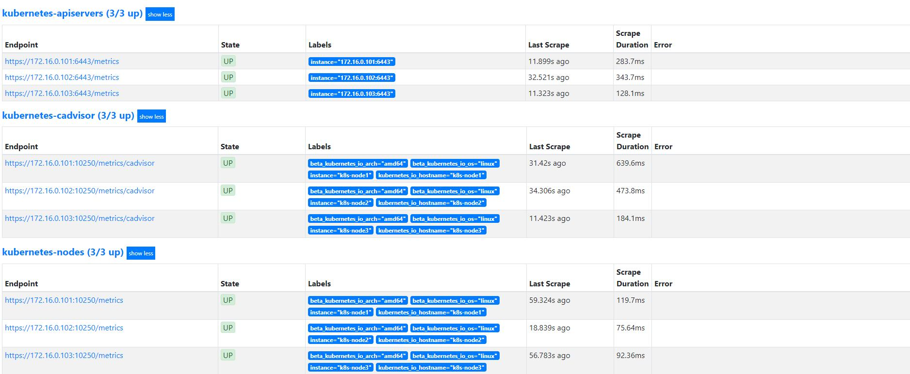
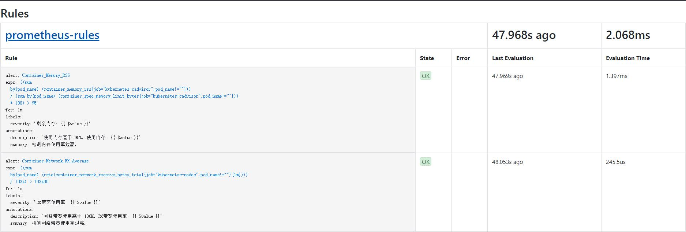
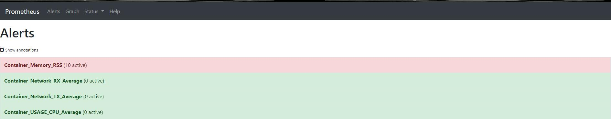

# 什么是Prometheus?

Prometheus是由SoundCloud开源监控告警解决方案, 从2012年开始编写代码, 再到2015年github上开源以来, 已经吸引了9k+关, 以及很多大公司的使用; 2016年Prometheus成为继k8s后, 第二名CNCF(Cloud Native Computing Foundation)成员。

## 主要功能

- 多维数据模型(时序由 metric名字和k/v的labels构成)。
- 灵活的查询语句(PromQL)。
- 无依赖存储, 支持local和remote不同模型。
- 采用http协议, 使用pull模式, 拉取数据, 简单易懂。
- 监控目标, 可以采用服务发现或静态配置的方式。
- 支持多种统计数据模型, 图形化友好。

## 基础架构


## Install

#### Deployment kube-state-metrics

说明：主要用于收集k8s服务metric信息

```sh
# kubectl apply -f https://raw.githubusercontent.com/Donyintao/Prometheus/master/kube-state-metrics-rbac.yaml
# kubectl apply -f https://raw.githubusercontent.com/Donyintao/Prometheus/master/kube-state-metrics-deployment.yaml
```

#### Deployment node-directory-size-metrics

说明：主要用于读取节点目录，获取磁盘使用metric数据

```sh
# kubectl apply -f https://raw.githubusercontent.com/Donyintao/Prometheus/master/node-directory-size-metrics.yaml
```

#### Deployment prometheus-node-exporter

说明：主要用于收集节点信息

```sh
# kubectl apply -f https://raw.githubusercontent.com/Donyintao/Prometheus/master/prometheus-node-exporter.yaml
```

#### Deployment prometheus service

```sh
# kubectl apply -f https://raw.githubusercontent.com/Donyintao/Prometheus/master/prometheus-rbac.yaml
# kubectl apply -f https://raw.githubusercontent.com/Donyintao/Prometheus/master/prometheus-configmap.yaml
# kubectl apply -f https://raw.githubusercontent.com/Donyintao/Prometheus/master/prometheus-deployment.yaml
# kubectl apply -f https://raw.githubusercontent.com/Donyintao/Prometheus/master/prometheus-ingress.yaml
```
## 验证Prometheus服务

通过域名`http://prometheus.host.com`来访问Prometheus的界面，查看已经搜集到的数据和Targets状态以及报警规则等信息。





## 总结

通过向Kubernetes集群内部署Prometheus，我们在不修改任何集群配置的状态下，利用Prometheus 的服务发现功能获得了基本的集群监控能力，并通过web界面对监控系统获取到的数据做了基本的查询。

下面我们将进一步完善Prometheus的使用：
+ 增加更多的监控数据源
+ 使用Grafana图形化的展示搜集到的监控数据
+ 使用AlertManager实现异常提醒